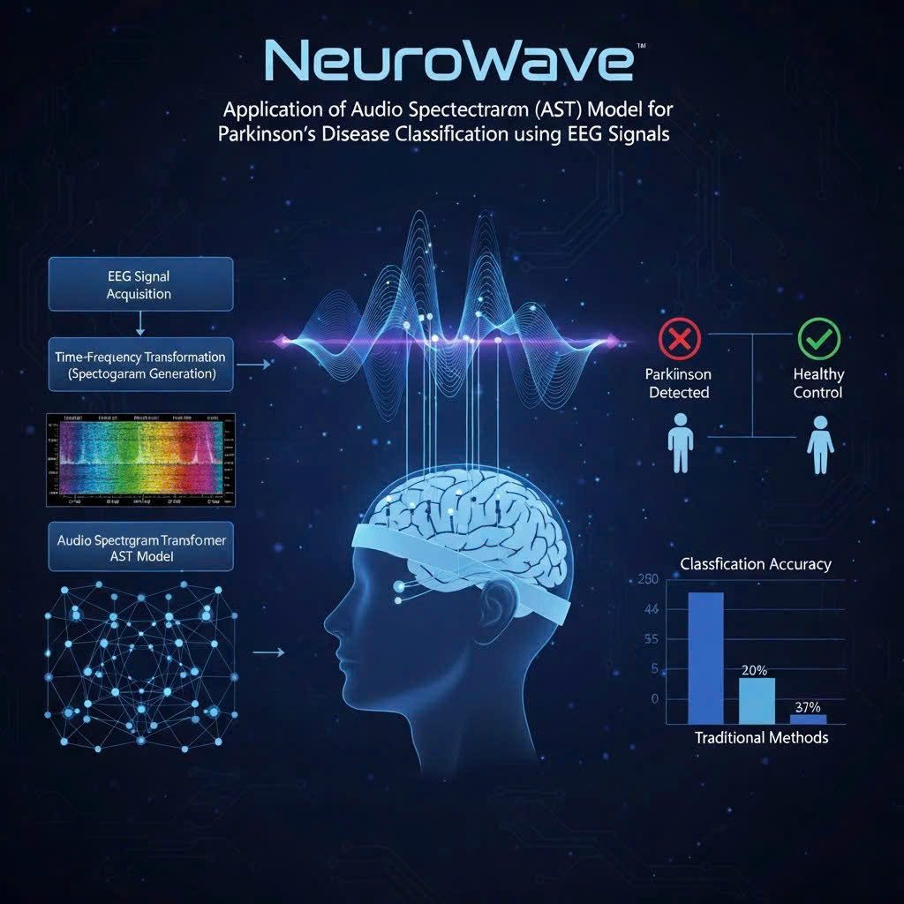
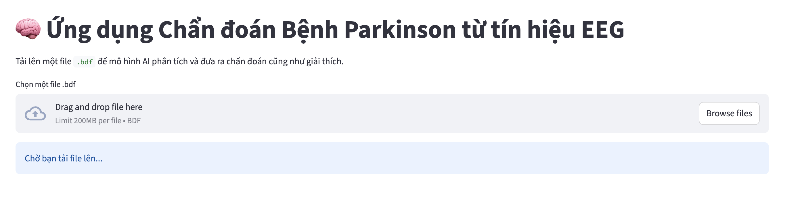
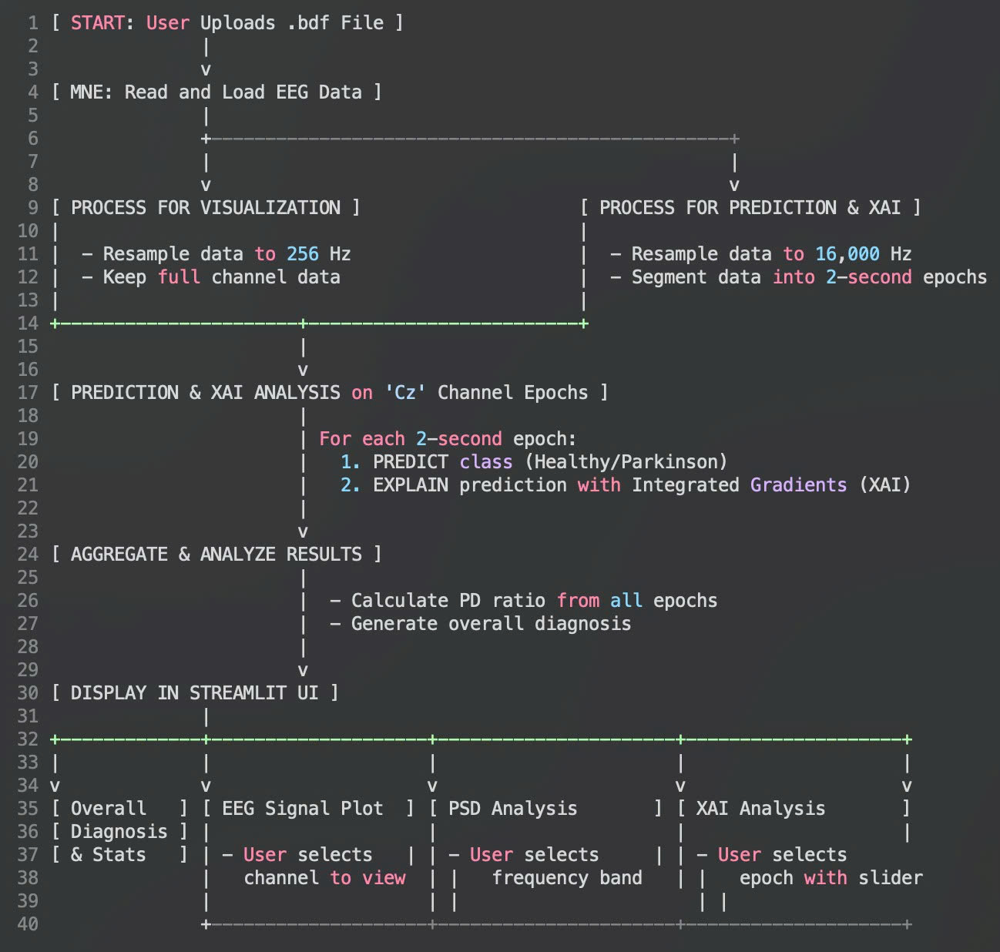
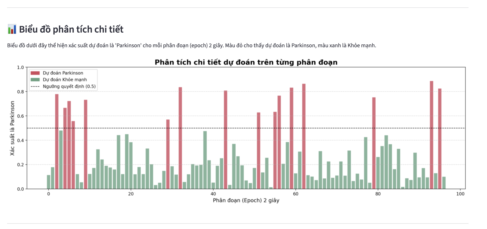
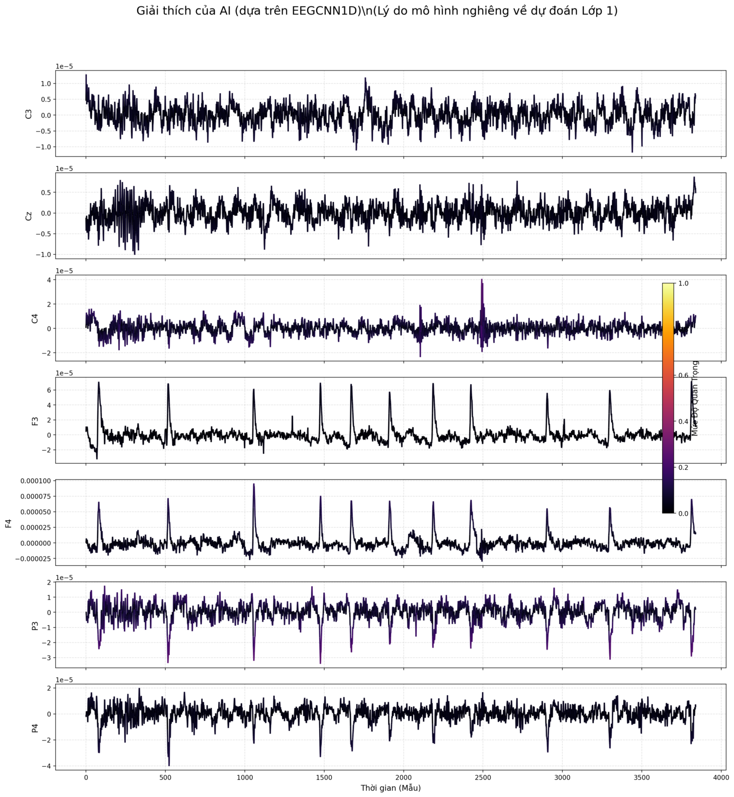
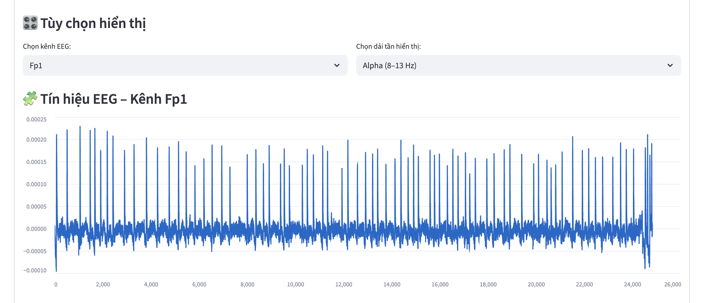

# NeuroWave: Application of Audio Spectrogram Transformer (AST) Model for Parkinson's Disease Classification using EEG Signals

 <!-- Giả sử có hình ảnh cover trong thư mục images; thay thế bằng tên file thực tế nếu có -->

## Table of Contents
- [Project Description](#project-description)
- [Key Features](#key-features)
- [Team Members](#team-members)
- [Contributors](#contributors)
- [Installation](#installation)
- [Usage](#usage)
- [Contributing](#contributing)
- [Acknowledgments](#acknowledgments)
- [License](#license)
- [I. Basic Information about the Project](#i-basic-information-about-the-project)
- [II. Project Background and Objectives](#ii-project-background-and-objectives)
- [III. Methodology](#iii-methodology)
- [IV. Key Results and Contributions](#iv-key-results-and-contributions)
- [V. Limitations and Future Work](#v-limitations-and-future-work)

## Project Description

NeuroWave is a capstone project developed by Group 5 at FPT University, Can Tho Campus. The project focuses on leveraging Artificial Intelligence (AI) and Deep Learning (DL) techniques to classify individuals with Parkinson's Disease (PD) based on Electroencephalography (EEG) signals. Parkinson's Disease is a progressive neurodegenerative disorder that affects motor control, speech, and cognitive functions. Traditional diagnostic methods rely heavily on subjective clinical evaluations, which can lead to inconsistencies. This project aims to provide a more objective, accurate, and early diagnostic tool using advanced models like the Audio Spectrogram Transformer (AST).

The project includes data preprocessing (band-pass filtering, ICA artifact removal), model training/validation, and deployment strategies for scalability.

## Key Features
- **Time-Series Approach**: Analyzes EEG signals in the time domain using Convolutional Neural Networks (CNN) and Long Short-Term Memory (LSTM) to capture temporal dependencies.
- **AST Approach**: Transforms EEG signals into time-frequency spectrograms and processes them using Vision Transformer (ViT) or Audio Spectrogram Transformer models.
- **Web Application**: Streamlit-based interface for uploading EEG files (.bdf), performing classification, and visualizing results with explainable AI (XAI) features.
- **Explainable AI**: Uses techniques like Integrated Gradients to highlight important EEG channels and features contributing to the model's predictions.

 <!-- Hình ảnh từ Figure 1 trong PDF: Time-frequency analysis of an EEG signal -->

 <!-- Hình ảnh từ Figure 2: EEG signals processed via band-pass filtering, ICA, etc. -->

 <!-- Hình ảnh từ Figure 3: Proposed EEG Classification Framework using AST -->

 <!-- Hình ảnh từ Figure 5: Explainable AI on EEG test file -->

 <!-- Hình ảnh từ Figure 4: Website interface implemented with Streamlit -->

For more details, refer to the full report in [SLP301_GROUP5_Report.pdf](SLP301_GROUP5_Report.pdf).

## Team Members

This project was developed by the following core team members:

- **Lê Thị Huỳnh Như (Leader)**  
  Email: nhuhuynhlethi1508@gmail.com  
  GitHub: [Huynhnhu169](https://github.com/Huynhnhu169)

- **Phạm Phan Công Lệnh**  
  Email: conglenhta@gmail.com  
  GitHub: [ttlenh04](https://github.com/ttlenh04)

- **Phạm Nguyễn Hoàng Thắng**  
  Email: thangpnh.work@gmail.com  
  GitHub: [WeenPham](https://github.com/WeenPham)

- **Trần Trung Nhân**  
  Email: baghet27@gmail.com  
  GitHub: [ChuongMon](https://github.com/ChuongMon)

- **Võ Phong Vinh**

Supervisor: Dr. Trần Ngọc Hoàng, Faculty of Artificial Intelligence, FPT University.

## Contributors
- **Lê Thị Huỳnh Như** – Data preprocessing & literature review  
- **Phạm Phan Công Lệnh** – Time-series model development  
- **Phạm Nguyễn Hoàng Thắng** – AST model fine-tuning & analysis

## Installation

To set up the project locally, follow these steps:

1. Clone the repository:
git clone https://github.com/WeenPham/Neuro-Wave.git
cd neuro-wave

2. Install the required dependencies using pip (preferably in a virtual environment):
pip install -r requirements.txt

If `requirements.txt` is not available, install the key libraries manually:
pip install streamlit mne torch torchvision torchaudio transformers captum matplotlib numpy pyngrok

3. Download the pre-trained models:
- AST model: Extract `ast-finetuned-pd.zip` to the project root.
- CNN model: Place `eeg_cnn_model_weights.pth` in the root directory (if available).

## Usage

### Running the Application Locally
1. Navigate to the project directory.
2. Run the Streamlit app:
streamlit run app.py

3. Open the provided local URL (usually `http://localhost:8501`) in your browser.
4. Upload an EEG file in `.bdf` format.
5. The app will process the file, provide a PD diagnosis, risk level, epoch-wise predictions, explainable visualizations, and interactive EEG signal explorations.

### Running on Google Colab
1. Open `app.ipynb` in Google Colab.
2. Mount Google Drive and extract the model zip file as shown in the notebook.
3. Install dependencies as per the cells.
4. Set up Ngrok for public access (paste your Ngrok authtoken when prompted).
5. Run the app and access the public URL provided by Ngrok.

**Note**: For best results, use EEG files with channels like Cz, and ensure the file duration allows for epoch segmentation (e.g., at least 30 seconds).

### Example Output
- Diagnosis: e.g., "High risk of Parkinson's Disease".
- Visualizations: Epoch prediction charts, CNN explanations, PSD plots, and band power analyses.

## Contributing

Contributions are welcome! Please fork the repository and submit a pull request with your improvements. Ensure your code follows the project's style and includes tests where applicable.

## Acknowledgments

We extend our gratitude to Dr. Tran Ngoc Hoang for guidance, our team members for collaboration, and our families for support. This project builds on open-source libraries like MNE, Transformers, and Captum.

## License

This project is licensed under the MIT License - see the [LICENSE](LICENSE) file for details.

MIT License

Copyright (c) 2025 Group 5, FPT University

Permission is hereby granted, free of charge, to any person obtaining a copy
of this software and associated documentation files (the "Software"), to deal
in the Software without restriction, including without limitation the rights
to use, copy, modify, merge, publish, distribute, sublicense, and/or sell
copies of the Software, and to permit persons to whom the Software is
furnished to do so, subject to the following conditions:

The above copyright notice and this permission notice shall be included in all
copies or substantial portions of the Software.

THE SOFTWARE IS PROVIDED "AS IS", WITHOUT WARRANTY OF ANY KIND, EXPRESS OR
IMPLIED, INCLUDING BUT NOT LIMITED TO THE WARRANTIES OF MERCHANTABILITY,
FITNESS FOR A PARTICULAR PURPOSE AND NONINFRINGEMENT. IN NO EVENT SHALL THE
AUTHORS OR COPYRIGHT HOLDERS BE LIABLE FOR ANY CLAIM, DAMAGES OR OTHER
LIABILITY, WHETHER IN AN ACTION OF CONTRACT, TORT OR OTHERWISE, ARISING FROM,
OUT OF OR IN CONNECTION WITH THE SOFTWARE OR THE USE OR OTHER DEALINGS IN THE
SOFTWARE.

## I. Basic Information about the Project

| Category           | Details                                                                                                             | Source |
| ------------------ | ------------------------------------------------------------------------------------------------------------------- | ------ |
| **Project Name**   | NeuroWave                                                                                                           |        |
| **Official Title** | *Application of Audio Spectrogram Transformer (AST) Model for Parkinson's Disease Classification using EEG Signals* |        |
| **Team Members**   | Group 5 (Lê Thị Huỳnh Như, Phạm Phan Công Lệnh, Phạm Nguyễn Hoàng Thắng, Võ Phong Vinh, Trần Trung Nhân)            |        |
| **Supervisor**     | Dr. Trần Ngọc Hoàng                                                                                                 |        |
| **Timeline**       | November 2025 (Cần Thơ)                                                                                             |        |

## II. Project Background and Objectives

### 1. Background

Currently, Parkinson's Disease (PD) diagnosis primarily relies on subjective clinical evaluations and the neurologist’s expertise. This dependence often leads to inconsistencies, especially in early stages where symptoms are ambiguous. Although neuroimaging techniques such as MRI and PET provide high accuracy, they are costly and impractical for regular screening.

The **NeuroWave** project addresses the urgent need for an **objective, non-invasive, and cost-effective diagnostic tool** by utilizing **EEG signals**, which capture real-time brain electrical activity. Studies have demonstrated that PD patients exhibit distinctive neural oscillation patterns—particularly in the **beta (13–30 Hz)** and **theta (4–7 Hz)** frequency bands—making EEG a viable biomarker.

### 2. Main Objectives

The project aims to develop an **integrated deep learning framework** to classify PD from EEG signals, with the following specific goals:

1. Design and implement two independent deep learning models for PD classification:

   * A **Time-Series Model** (using CNN and LSTM)
   * A **Transformer-Based Model** (using AST or ViT on spectrogram representations)
2. Develop a **standardized EEG preprocessing pipeline** (band-pass filtering 0.5–45 Hz, noise removal via ICA, segmentation) to ensure data consistency and reproducibility.
3. Evaluate and compare both approaches using **quantitative metrics** (Accuracy, Precision, Recall, F1-score, AUC) and **qualitative analysis** (interpretability, stability).
4. Investigate the **effectiveness of Transformer architectures** in learning EEG representations—particularly their ability to capture long-range dependencies and model time–frequency patterns from spectrograms.

## III. Methodology

The project uses the **UC San Diego Resting-State EEG Dataset** for Parkinson's Disease (ds002778) from the **OpenNeuro repository**, comprising 31 participants (15 PD patients and 16 healthy controls, HC).

### 1. Data Preprocessing Pipeline

The raw EEG data (512 Hz sampling rate, 32 channels) undergoes a standardized pipeline:

* **Filtering:** Apply a band-pass filter (0.5–50 Hz) to remove noise and retain physiologically relevant oscillations.
* **Artifact Removal:** Use **Independent Component Analysis (ICA)** to eliminate components caused by eye blinks, muscle movements, or motion artifacts.
* **Normalization & Segmentation:** Normalize and segment signals into fixed-length windows (typically 2 seconds) for model input.

### 2. Parallel Modeling Approaches

| Approach                        | Description                                                                                                                                                                                                            | Role                                                                                                       |
| ------------------------------- | ---------------------------------------------------------------------------------------------------------------------------------------------------------------------------------------------------------------------- | ---------------------------------------------------------------------------------------------------------- |
| **Time-Series Approach**        | Uses a **CNN-LSTM architecture** to directly learn spatial and temporal dynamics from raw EEG signals.                                                                                                                 | Improved by *Phạm Phan Công Lệnh*                                                                          |
| **Spectrogram (AST) Approach**  | Converts EEG into **Mel Spectrograms** (time–frequency 2D representations). These are processed using the **Audio Spectrogram Transformer (AST)** model, leveraging self-attention to capture long-range dependencies. | Improved by *Phạm Nguyễn Hoàng Thắng*, with **Transfer Learning** from a pretrained AST model on AudioSet. |
| **Traditional ML (Comparison)** | Baseline models such as Random Forest, SVM, and KNN trained on handcrafted features (e.g., Higuchi’s and Katz’s Fractal Dimensions).                                                                                   |                                                                                                            |

## IV. Key Results and Contributions

### 1. Quantitative Results

After training and evaluation on the test set, the **AST model** outperformed other approaches:

| Metric   | Time-Series (CNN-LSTM) | AST (Transformer) | Traditional ML (Random Forest) |
| -------- | ---------------------- | ----------------- | ------------------------------ |
| Accuracy | 72.4%                  | **79.7%**         | 59.03% (Epoch Accuracy)        |
| F1-Score | 0.72                   | **0.79**          | N/A                            |
| AUC-ROC  | 0.77                   | **0.83**          | N/A                            |

**Conclusion:** The AST model achieved 7.3% higher accuracy than CNN-LSTM, highlighting the effectiveness of **spectrogram-based representations** for capturing both temporal and frequency domains.

### 2. Explainable AI (XAI)

The project integrated **Explainable AI techniques**, specifically **Integrated Gradients**, to visualize feature contributions in the AST model.

* XAI analysis revealed that AST focused on **biologically relevant EEG frequency bands**, such as enhanced **beta activity (13–30 Hz)** in PD patients.
* This improved **clinical interpretability**, addressing the "black-box" issue of deep learning in biomedical diagnostics.

### 3. Prototype Deployment

A **Streamlit-based web prototype** was developed, allowing users to upload EEG files, receive real-time classification results (PD or HC), and visualize spectrograms, EEG frequency bands, and XAI outputs.

## V. Limitations and Future Work

### 1. Main Limitations

* **Dataset Size:** The dataset is relatively small (31 subjects), limiting statistical power and model generalizability.
* **Medication Effects:** Some PD patients were medicated, which may normalize EEG patterns and introduce classification bias.
* **Technical Constraints:** Computational resource limitations restricted exploration of more complex deep architectures.

### 2. Future Directions

1. **Larger Dataset Validation:** Validate models on larger, multi-center, and more diverse EEG datasets to enhance generalization.
2. **Medication Effect Analysis:** Develop multi-class models to differentiate between HC, medicated PD, and unmedicated PD groups.
3. **System Enhancements:** Improve the web prototype by integrating real-time EEG streaming and exploring alternative XAI methods (e.g., attention map visualization) for deeper physiological insights.

**In summary**, NeuroWave is positioned as an academic research initiative aiming to compare and evaluate deep learning approaches for EEG-based Parkinson's classification. The project also proposes a **standardized, reproducible preprocessing and modeling framework** suitable for future biomedical applications.
